# ✨ FinTrackr 📝

> A **full-stack blogging platform** built with the **MERN stack** (MongoDB, Express.js, React, Node.js), offering smooth content management, user interaction, and modern web features.  
>  
> 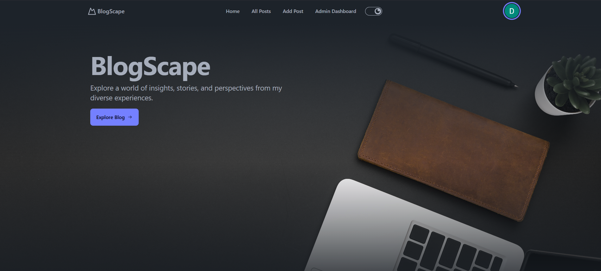

---

## 🚀 Deployment

- 🔗 **Frontend**: [Vercel](https://blog-space-blond.vercel.app)  
- 🔗 **Backend**: [Render](https://blogspace-1-kjm6.onrender.com)

---

## 🌟 Features Overview

🔐 <strong>Google OAuth Login</strong>

Users can sign in using their **Google account**, ensuring secure and fast authentication.  
No need to remember separate passwords!

 

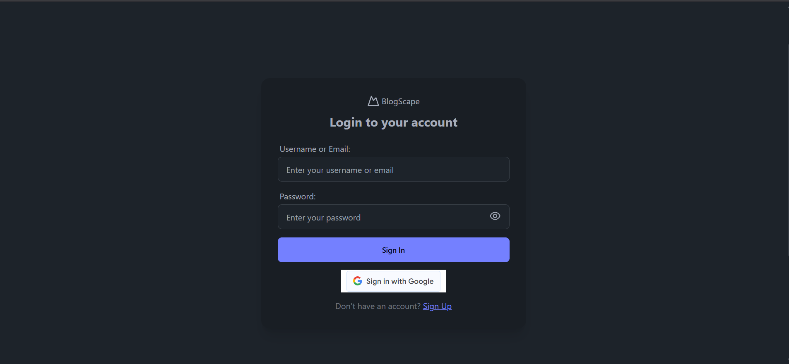

---

🏠 <strong>Home Page with Blogs</strong>

The homepage displays all blog posts fetched from the backend, featuring pagination and real-time updates.  
Users can scroll through featured content easily.

 

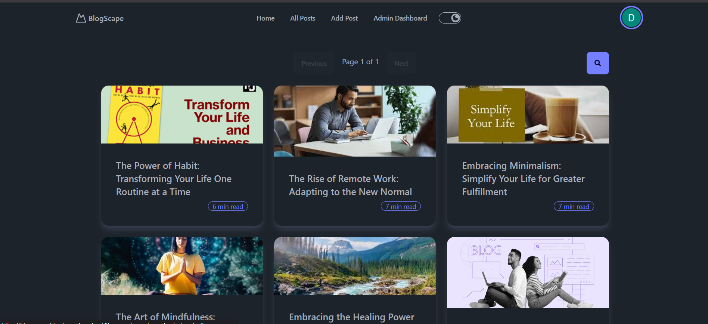

---

🔍 <strong>Search & Filter Blogs</strong>

Users can search blog posts by **title or content**, and filter results by **date** for quicker access to relevant posts.

 

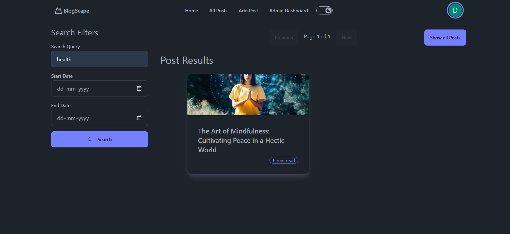

---

✍️ <strong>Admin-Only Blog Creation</strong>

Only **admin users** can create and publish blog posts.  
The form is optimized using **React Hook Form** and **Zod** for validation.

 

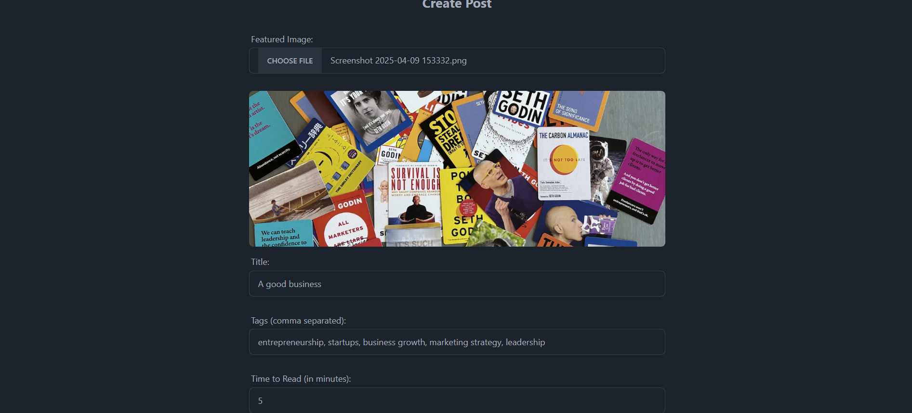  
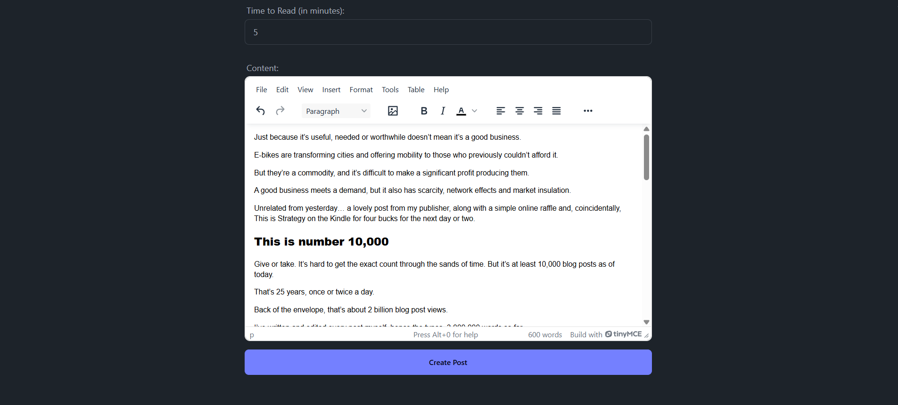

---

📝 <strong>Blog Detail Page</strong>

Clicking on a blog opens the full content, where users can **read**, **like**, and **comment** on the post.

 

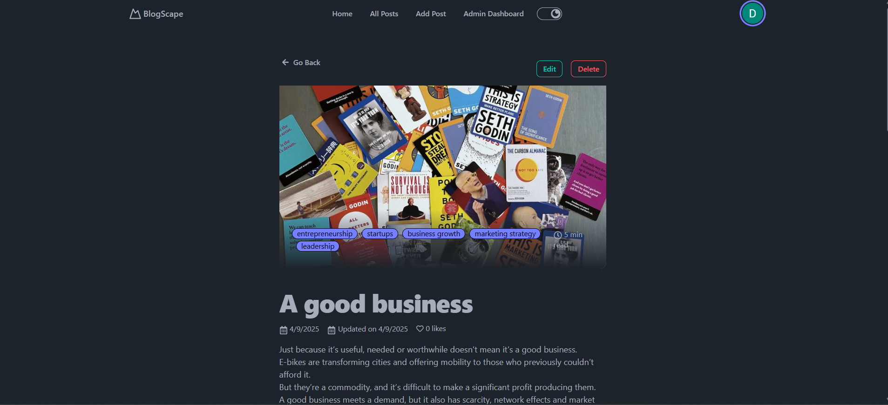

---

❤️ <strong>Like & Comment</strong>

Users can like blog posts and leave comments to engage with authors and readers.

 

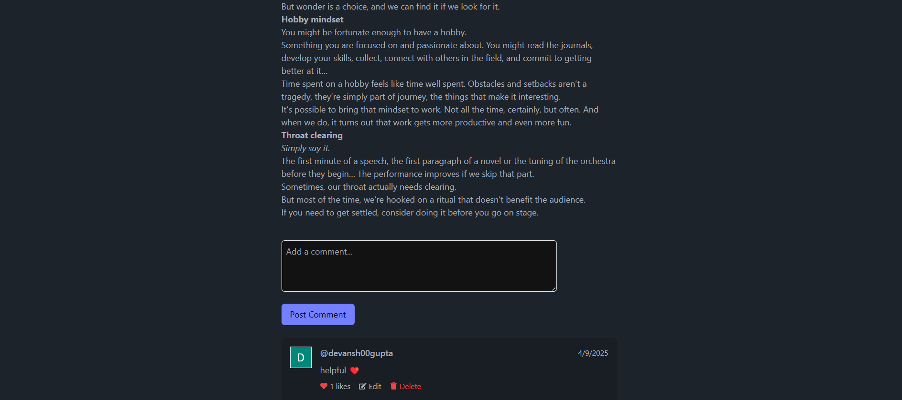

---

⚙️ <strong>Admin Dashboard</strong>

Admins have access to a powerful dashboard to **manage users, posts, and comments**.  
They can update or delete any content as needed.

 

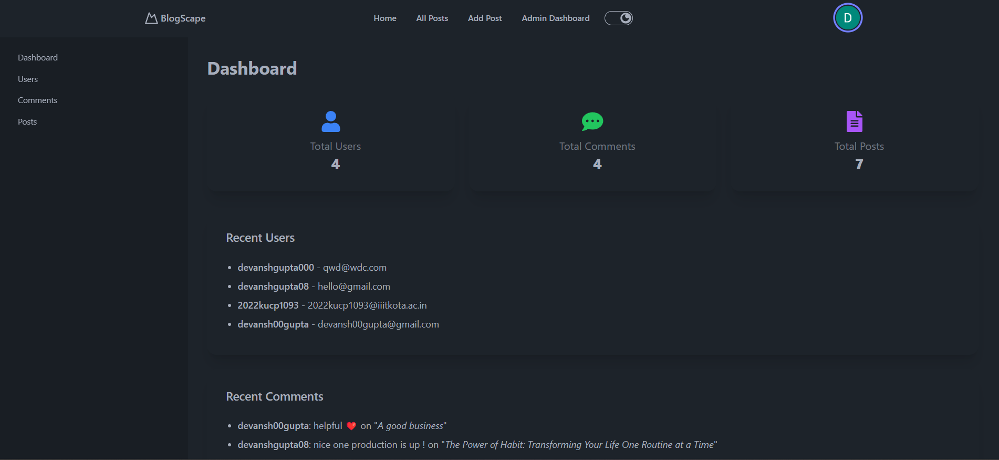  
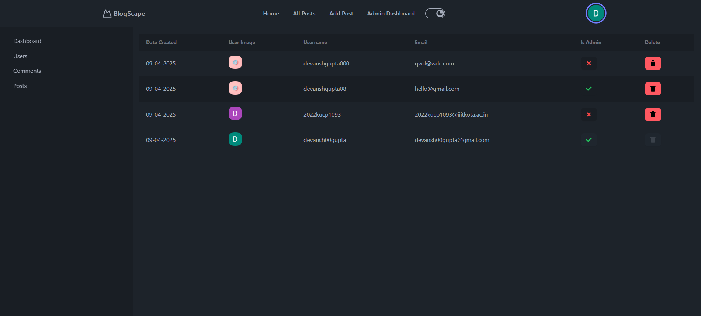  
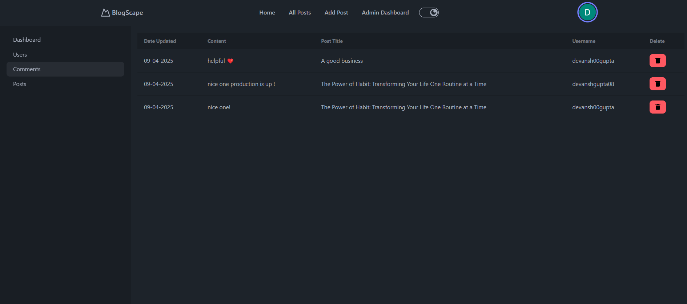  
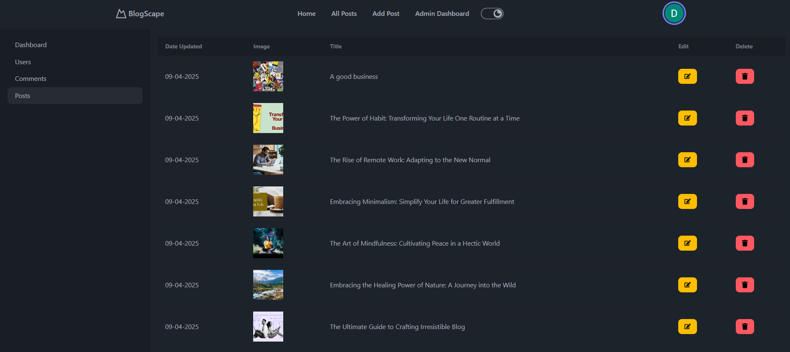

---

🖼️ <strong>Cloudinary Image Upload</strong>

Images for blogs and profiles are uploaded directly to **Cloudinary**, ensuring fast delivery and automatic optimization.

---

🌓 <strong>Theme Toggle (Dark / Light Mode)</strong>

Switch between **light and dark themes** based on user preference.  
Theme choice is **persisted across sessions**.

 

**Light Mode**  
 
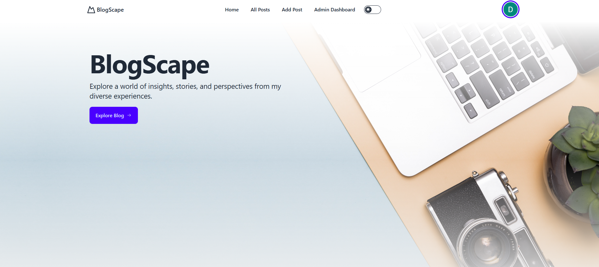

 

**Dark Mode**  
 

---

👤 <strong>Profile Management</strong>

Users can update their **name, profile picture**, and other details from their profile section.

 

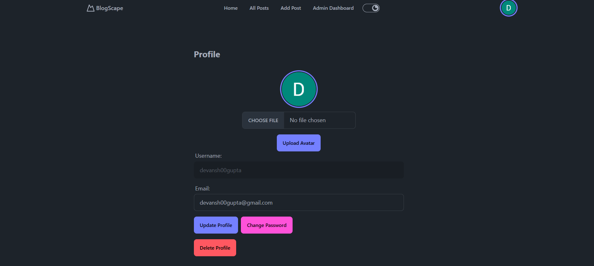

---

📑 <strong>Pagination</strong>

Large lists of blog posts are **paginated** for better performance and smoother user experience.

---

## 🛠️ Technologies Used

| Layer        | Tech Stack                                                                       |
|--------------|-----------------------------------------------------------------------------------|
| **Frontend** | React, React Router DOM, Redux, React Query, DaisyUI, React Hook Form            |
| **Backend**  | Node.js, Express.js, MongoDB, Mongoose, Zod, bcrypt, Cloudinary                  |
| **Auth**     | Google OAuth                                                                     |
| **Utilities**| Slugify, CORS, JWT                                                               |

---
